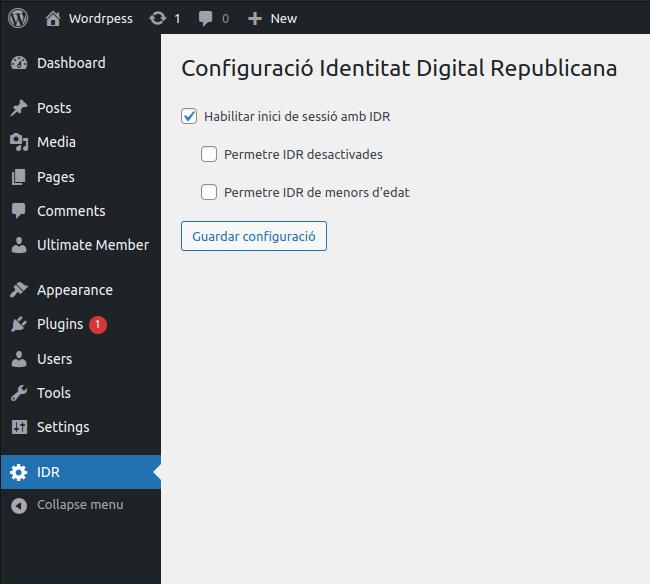

# Wordpress - Identitat Digital Republicana (IDR)

Plugin de Wordpress per a la integració amb el procés de validació de la Identitat Digital Republicana del Consell de la República Catalana

## Funcionalitats

- Assignació d'IDRs als usuaris
- Validació d'IDRs mitjançant el Consell de la República
- Inici de sessió amb l'IDR (Tant a la pàgina d'inici de sessió de Wordpress com a qualsevol altre plugin que permeti l'autenticació de mitjançant el filtre `authenticate`)
- Panell d'administració per a configurar les opcions de validació de les IDRs.

## Imatges

 

 

 

